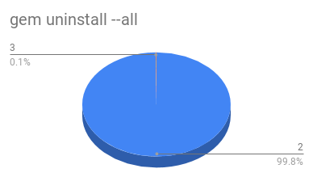

# Ruby GSOC 2018
This is a repository for Ruby GSOC 2018.
More information on my project can be found at:
https://summerofcode.withgoogle.com/projects/5822943355994112

## Transient Heap
The first discuss of transient heap was opened by ko1(Koichi Sasada) at [Introduce 2nd GC heap named Transient heap](https://bugs.ruby-lang.org/issues/14858). In his prototype, he completed the implement for array, and the future work including supporting String, Hash and Extend(shrink) policy for transient heap.

My work here is adding support for Hash so that transient heap can allocate space for Hash. But it has difficults that has to be handled.
1. Hash type objects use st_table to store elements, the correlation between those two is weak. For transient heap, it has to know the ruby type of the objects.
2. Transient heap is based on the hypothesis that most of objects die in young. We need to survey the distribution of hash size.

### The distribution of hash size
#### Implement
The capacity of st_table is always the power of 2, we recorded the exponent into a global array before gc or functions manually free st_table. Look at the [patch](patch/st_table_size_statistics.patch) for more details.
#### Results
We measured 6 applications in order to find a real distribution of the hash size. Respectively, those applications are:
1. `make check` command under ruby source code.
2. `make gcbench_rdoc` command under ruby source code.
3. `gem uninstall --all` to uninstall over 300 gems
4. `bundle install` commmand under project [discourse](https://github.com/discourse/discourse)
5. `discourse` manually explore the web pages and simulate the different events for about 20 minutes (development environment)
6. `rails_ruby_bench` project [rails_ruby_bench](https://github.com/noahgibbs/rails_ruby_bench) with parameters : 8 workers, 1500 iterations
7. `rails_ruby_bench 2` 8 workers, 12000 iterations
8. `rails_ruby_bench 3` 20 workders, 20000 iterations

The results show that objects under size 8(area of exponent 2 to 3) account for more than 80% of the total data in most situations. The raw data can be found at [st_table size statistics](https://docs.google.com/spreadsheets/d/1xAjO_qb5K49aLnvk8SypGwO5Avtbm2X12cYb1d-n6Xs/edit?usp=sharing).





### Add Hash support
According to the previous survey result, we use a array-like fixed-size table to store the elements. We name it as LinearTable.
In this way, we have two benefits:

1. We don't have to create st_table for small hash(but it will when necessary)
2. the code is written into hash.c (while st_table code is in st.c). its easy to bind small hash with transient heap, and by default, when using st_table, it uses the malloced space.

So the basic data structure are looked like this.
```c
#define LINEAR_TABLE_MAX_SIZE 8

typedef struct li_table_entry {
    VALUE hash;
    VALUE key;
    VALUE record;
} li_table_entry;

typedef struct LinearTable {
    const struct st_hash_type *type;
    li_table_entry entries[LINEAR_TABLE_MAX_SIZE];
} li_table;

struct RHash {
    struct RBasic basic;
    union {
	struct st_table *ntbl;      /* possibly 0 */
	struct LinearTable *ltbl;
    } as;
    int iter_lev;
    const VALUE ifnone;
};

```


#### The layout of li_table_entry
Considering the size of 8 hashes/keys/records is just the size of a cache line, we also tried different data layouts.

```c
#define LINEAR_TABLE_MAX_SIZE 8

// the original layout
typedef struct li_table_entry {
    VALUE hash;
    VALUE key;
    VALUE record;
} li_table_entry;

typedef struct LinearTable {
    const struct st_hash_type *type;
    li_table_entry entries[LINEAR_TABLE_MAX_SIZE];
} li_table;
```

```c
#define LINEAR_TABLE_MAX_SIZE 8

// the original layout
typedef struct li_table_entry {
    VALUE hash;
    VALUE key;
    VALUE record;
} li_table_entry;

typedef struct LinearTable {
    const struct st_hash_type *type;
    li_table_entry entries[LINEAR_TABLE_MAX_SIZE];
} li_table;
```

```c
#define LINEAR_TABLE_MAX_SIZE 8

// The Variant 1
typedef struct li_table_entry {
    VALUE key;
    VALUE record;
} li_table_entry;

typedef struct LinearTable {
    const struct st_hash_type *type;
    VALUE hashes[LINEAR_TABLE_MAX_SIZE];
    li_table_entry pairs[LINEAR_TABLE_MAX_SIZE];
} li_table;
```

```c
#define LINEAR_TABLE_MAX_SIZE 8

// The Variant 2
typedef struct li_table_entry {
    VALUE hash;
    VALUE key;
} li_table_entry;

typedef struct LinearTable {
    const struct st_hash_type *type;
    li_table_entry entries[LINEAR_TABLE_MAX_SIZE];
    VALUE records[LINEAR_TABLE_MAX_SIZE];
} li_table;
```

```c
#define LINEAR_TABLE_MAX_SIZE 8

// The Variant 3
typedef struct LinearTable {
    const struct st_hash_type *type;
    VALUE hashes[LINEAR_TABLE_MAX_SIZE];
    VALUE keys[LINEAR_TABLE_MAX_SIZE];
    VALUE records[LINEAR_TABLE_MAX_SIZE];
} li_table;
```

The [microbench results](https://docs.google.com/spreadsheets/d/1Ag6DoAsmTNJkt3nmHyfXRQgy6fLhEnZJQF2G5GbykLc/edit?usp=sharing) show the original edition and variant 1 have better performance than the other two. The patches can be found in the repository as [linear_table_v1.patch](patch/linear_table_v1.patch), [linear_table_v2.patch](patch/linear_table_v2.patch), [linear_table_v3.patch](patch/linear_table_v3.patch), [linear_table_v4.patch](patch/linear_table_v4.patch);

#### Integrate data into flag bits
Considering the maximum size of entries is 8. We can store the num_entries and num_bound into RBasic(hash)->flag;

Related patch is [here](patch/0003-integrate-data-to-hash-flag.patch) which based on [linear_table_v1.patch](patch/linear_table_v1.patch)

### Benchmark results
We execuated comprehensive benchmark test based on official benchmark tool - [benchmark-driver](https://github.com/benchmark-driver/benchmark-driver).
1. [linear_table_benchmark](https://docs.google.com/spreadsheets/d/18JzY-q-boOZFu_GTwraRXSTJJVbt9Wmg7M2P4-8g41o/edit?usp=sharing), includes the `make benchmark` results of trunk vs. v1(the original version) vs. v2(the variant 1).
2. [transient hash benchmark](https://docs.google.com/spreadsheets/d/19074A0H0nwBQoumTb0aF-k9_a3GBBLA9NnFIpPGraPU/edit?usp=sharing), includes the `make benchmark` results of trunk vs. transient_heap(based on v1) vs. integrated flag
3. [linear_table_variant_benchmark](https://docs.google.com/spreadsheets/d/1Ag6DoAsmTNJkt3nmHyfXRQgy6fLhEnZJQF2G5GbykLc/edit?usp=sharing), includes the micro-benchmark results of trunk vs. v1 vs. v2 vs. v3 vs. v4. The used benchrmark scripts are located at microbench directory.
4.  [linear_table real app bench](https://docs.google.com/spreadsheets/d/1WoT2zRxm16DA-0fOf55HZKmRN9v2YJK4HoaMi6yq_0k/edit?usp=sharing), includes the six applications test results.
5.  [transient heap microbench](https://docs.google.com/spreadsheets/d/1guaP_93ds1eSbdSg87gBrtiuJ8JzSFHJb_xcQsxn8eg/edit?usp=sharing), include the micro-benchrmark resutls of trunk vs. v1 vs. transient-hash vs integrated-flag. This time we also add memory usage comparison.
6. [linear_table_vary_size_microbench](https://docs.google.com/spreadsheets/d/1I7NFc893H7cUh0CAFgBupT259pVMqRFjC9CQwlE8Kyw/edit?usp=sharing), we once worried the size of linear table will impact on the benchmark results because of the linear search. So we test the linear table with different size and the results show the table size doesn't make any difference.

### Future work
1. In [transient hash benchmark](https://docs.google.com/spreadsheets/d/19074A0H0nwBQoumTb0aF-k9_a3GBBLA9NnFIpPGraPU/edit?usp=sharing), we saw a preformance degradation compare to the preformance improvement in [linear_table_benchmark](https://docs.google.com/spreadsheets/d/18JzY-q-boOZFu_GTwraRXSTJJVbt9Wmg7M2P4-8g41o/edit?usp=sharing) in same items. It needs surveys and to be solved.


## Cache Line Hash Table
Besides the efforts for transient heap, my work in this period also includes a attempt to introduce a hash table algorithm named as [Cache Line Hash Table](https://github.com/LPD-EPFL/CLHT).

The attempt is failed due to two main reasion:
1. The hash table in ruby not only do the operations like insert, update, and delete, but also has lots of sequential operations like foreach, shift. The modification for this purpose will destroy the original design principle.
2. The memory usage is bad after modification.

Hence the development for cache line hash table stopped and the [patch](patch/0001-introduce-cache-line-hash-table.patch) and code is reversed in this repository. Benchmark results are saved as `report/bmlog-20180701-152738.21712.tsv` and `report/bmlog-20180706-155054.19279.tsv`.

## other work
The one goal of this project is explore the gc performance when Ruby allocated a large number of objects. We expected abnormal overheads when memory is under very high work load or running out. But the most significant overhead is reallocation when array or hash resizing its capacity. Otherwise, the time cost for operations like insertion changed stably.

The related scripts and reports are:
1. array_batch_benchmark.rb : Let's say we want to create a certain number of objects in one array, this number are divided into certain rounds, we want to know if the later rounds will spend more time than former rounds. The results ([report1](report/array_batch_benchmark_report_9B.txt) and [report2](report/array_batch_benchmark_report_25B.txt)) show it doesn't make any difference.
2. hash_batch_benchmark.rb : same as the one above expect changing array to hash. Reports are [this](report/hash_batch_benchmark_report_2B.txt) and [this](report/hash_batch_benchmark_report_5B.txt).
3. array_vary_size_benchmark.rb : We hope the creation time of array is linear and not exponential. And the results show they are close to linear relation. Reports are [this](report/array_benchmark_report_N30_v1.txt) and [this](report/array_benchmark_report_N31.txt).
4. hash_vary_size_benchmark.rb : same as the one above expect changing array to hash. Reports are [this](report/hash_benchmark_report_N30.txt) and [this](report/hash_benchmark_report_N32.txt).
